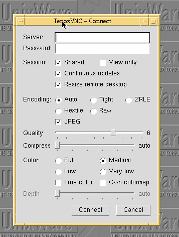

# TenoxVNC

VNC viewer for vintage Unix & VMS in plain C and X11. 

Based on TightVNC, with TigerVNC feature backports (dynamic desktop resizing, continuous updates, fence, desktop name, ZRLE).

## Downloads

Statically linked binaries for many OSes available under [Releases](https://github.com/tenox7/tenoxvnc/releases).

## Connection Parameters

Started with no server on the command line, the viewer puts up a connection
dialog with the options that usually need changing. Every option is also a
command line flag or X resource.

Each option is marked *server* (negotiated with or sent to the VNC server) or
*client* (local to the viewer and its X display).

- **Server** *(server)* — VNC server as `host`, `host:display` (display + 5900) or `host::port`.
- **Password** *(server)* — VNC password, kept until the server asks for it; ignored by servers with no authentication, overridden by `-passwd` or `VNC_PASSWORD`.
- **Shared** *(server)* — do not disconnect other clients already viewing that desktop (`-noshared` to take it exclusively).
- **View only** *(client)* — drop all local keyboard and mouse input instead of sending it to the server.
- **Continuous updates** *(server)* — let the server push updates on its own instead of one update request per frame, which is smoother on slow links.
- **Resize remote desktop** *(server)* — resizing the viewer window asks the server to resize its framebuffer to match, if it supports it.
- **Encoding** *(server)* — preferred encoding requested first: Auto lets the viewer pick (raw on the same machine, otherwise Tight), the rest force Tight, ZRLE, Hextile or Raw.
- **JPEG** *(server)* — allow lossy JPEG inside Tight encoding; off means Tight stays lossless.
- **Quality** *(server)* — JPEG quality 0-9, trading image fidelity for bandwidth; only meaningful with JPEG on.
- **Compress** *(server)* — zlib compression level 0-9 for Tight/Zlib, `auto` leaves it to the viewer (level 1, fast, for local networks).
- **Color** *(server)* — pixel format asked of the server: Full (native visual), Medium (256 colors, BGR233), Low (64, BGR222), Very low (8, BGR111); less color means less data.
- **True color** *(client)* — force a TrueColor X visual with its own colormap rather than using the display's default visual.
- **Own colormap** *(client)* — force a PseudoColor visual with a private colormap, for 8-bit displays whose shared colormap is full.
- **Depth** *(client)* — with True color on, require an X visual of exactly this depth (8/15/16/24/32); `auto` takes any.

## Supported Platforms

- AIX 4.x; 5.x
- HP-UX 10.x; 11.x
- IRIX 5.x; 6.x
- Tru64 (DEC Unix / OSF/1) 5.x
- SCO OpenServer 5.x; 6.x
- SCO UnixWare 7.x
- SunOS 4.x; 5.x (Solaris)
- OpenVMS 7.x; 8.x

## Credits

- TightVNC (Constantin Kaplinsky, AT&T Labs Cambridge)
- TigerVNC extensions (Cendio AB)
- zlib (Gailly/Adler)
- IJG jpeg-6b.
