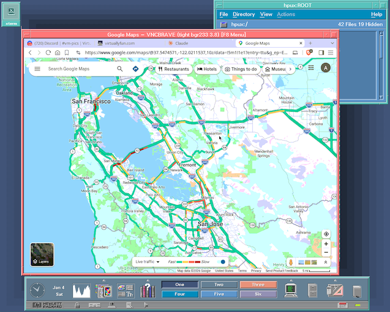

# TenoxVNC

VNC viewer for vintage Unix & VMS in plain C and X11. 

Based on TightVNC, with TigerVNC feature backports (dynamic desktop resizing, continuous updates, fence, desktop name, ZRLE).

## Downloads

Statically linked binaries for many OSes available under [Releases](https://github.com/tenox7/tenoxvnc/releases).

## Supported Platforms

- AIX 4.x; 5.x
- HP-UX 10.x; 11.x
- IRIX 5.x; 6.x
- Tru64 (DEC Unix / OSF/1) 5.x
- SCO SVR5 / SysV / ODT 5.x
- SCO UnixWare 7.x
- SunOS 4.x; 5.x (Solaris)
- OpenVMS 7.x; 8.x

## Credits

- TightVNC (Constantin Kaplinsky, AT&T Labs Cambridge)
- TigerVNC extensions (Cendio AB)
- zlib (Gailly/Adler)
- IJG jpeg-6b.
